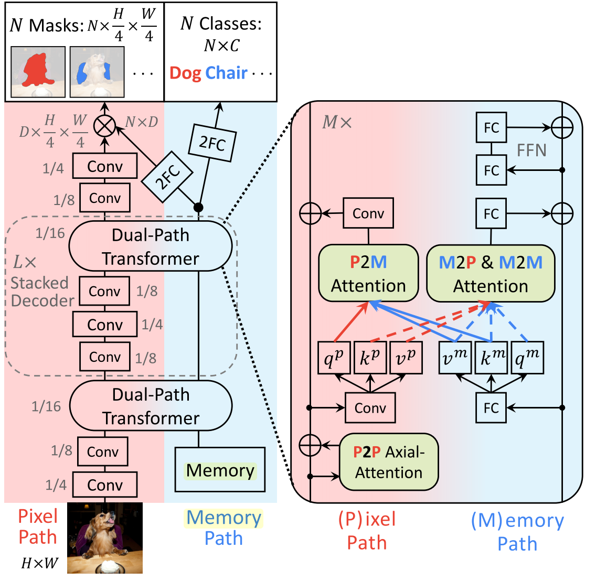

# MaX-DeepLab

Unofficial implementation of MaX-DeepLab for Instance Segmentation: https://arxiv.org/abs/2012.00759v1.

<figure>
  </img>
</figure>

## Current Status

This repository is under active development. Currently, only the MaX-DeepLab-S architecture is putatively complete. At the moment this code is best used as a reference. The ultimate goal is to develop and release a pre-trained model that reproduces the topline results of the paper.

- [x] Axial Attention block
- [x] Dual Path Transformer block
- [x] MaX-DeepLab-S architecture
- [x] Hungarian Matcher
- [x] PQ-style loss
- [x] Auxiliary losses (Instance discrimination, Mask-ID cross-entropy, Semantic Segmentation)
- [x] Coco Panoptic Dataset
- [x] Simple inference
- [ ] Optimize model runtime
- [ ] Encoder pre-training on ImageNet
- [ ] MaX-DeepLab-S training on COCO Panoptic
- [ ] MaX-DeepLab-L???

MaX-DeepLab has a complex architecture, training procedure and loss function. Any suggestions or help are appreciated.

## Usage

See example.ipynb.
